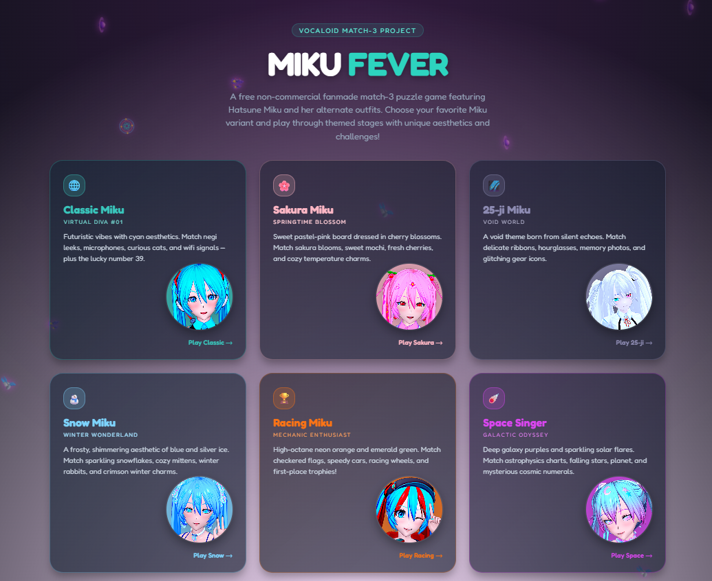
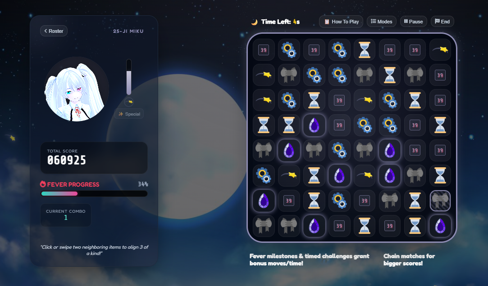
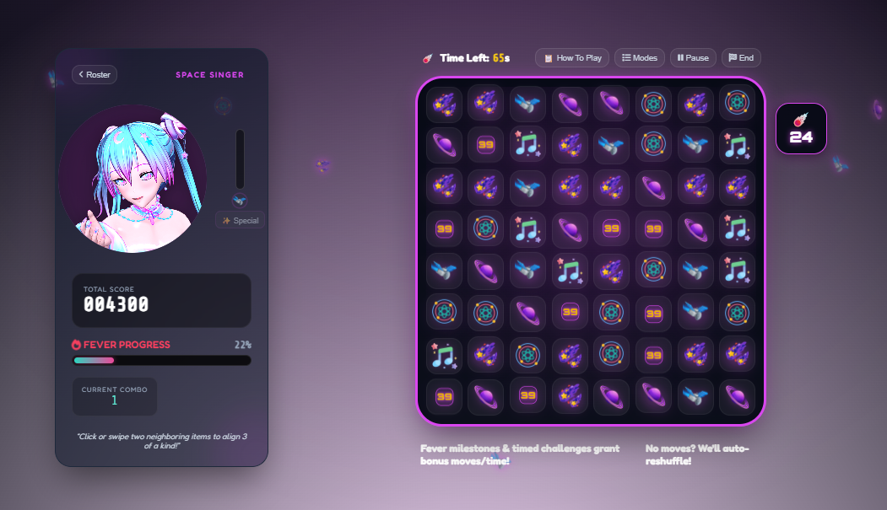
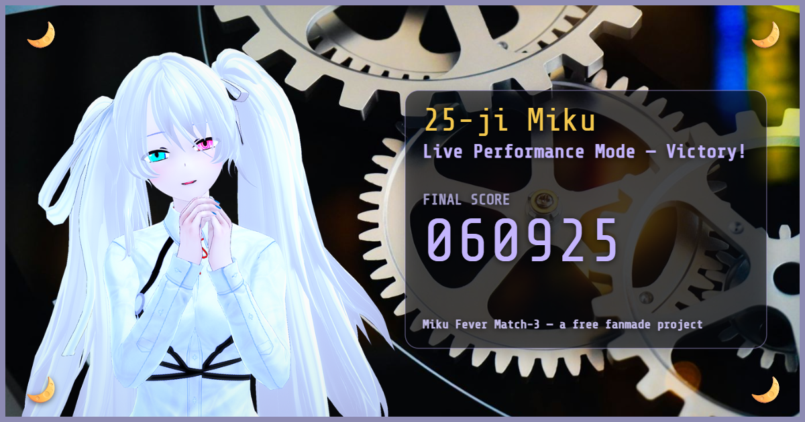

# Miku Fever Match-3

*[日本語版はこちら (Japanese version)](README.ja.md)*

A free, non-commercial fanmade match-3 puzzle game featuring Hatsune Miku and five of her alternate outfits — Sakura, 25-ji (Nightcord), Snow, Racing, and Space Singer. Pick your favorite, choose a mode, and match your way through themed boards, each with its own icon set, music, and a unique special ability.

Plays entirely in the browser, no install, no account, no ads. **[Available in English and Japanese](#language)** — flip the language toggle in the top-left corner any time, mid-game included.

## Screenshots

<!--
  Drop your captured PNGs into the screenshots/ folder using these exact
  filenames and the images below will show up automatically on GitHub.
  Caption style: Japanese line first, English in parentheses underneath —
  see PORTRAIT-SMOOTHING.pdf's before/after layout for the same convention
  applied to a comparison instead of a screenshot.
-->

| | |
|---|---|
|  |  |
| **キャラクター選択画面** *(Character select screen)* | **クラシック・ミクでプレイ中** *(Playing as Classic Miku)* |
|  |  |
| **コズミックグラビティ発動中** *(Cosmic Gravity activating)* | **ステージクリア勝利画面** *(Stage Clear victory screen)* |

## Features

- **6 playable Miku variants**, each with a fully distinct color palette, board icon set, music, sound effects, and character special ability.
- **3 game modes**:
  - **Stage Clear** — climb 100 move-limited levels. Reach Stage 50 and you get a choice: claim your Victory certificate on the spot, or keep climbing all the way to Stage 100 for an exclusive Legacy Certificate.
  - **Live Performance** — a 90-second time attack with a late-game difficulty ramp. Finishing the clock is always a win now — there's no fail state here, only how good your final score is.
  - **Leisure** — no timer, no game over, just relax.
- **A Fever system** shared across all modes: chain matches to level up Fever, hit milestones for bonus rounds and rewards.
- **Six unique specials** — from Classic Miku's Fever-boosting Harmony Wave, to Sakura's Blossom Blast (marks two tiles for a 3x3 clear each, always spaced apart so neither blast steps on the other — your mana stays full and ready until you've cleared both), to Space Singer's Cosmic Gravity, which lets you freely rearrange the board for a short window.
- **Juicy match feedback** — cleared tiles burst into a small shower of theme-colored particles, and board refills drop into place with a bit of weight behind them instead of just popping in.
- **Downloadable results certificates** — a shareable image generated after every run, with your score and a portrait of the character you played.
- **English / Japanese language toggle**, switchable anytime from the header, including mid-run.

## How to play

Match 3 or more of the same icon in a row or column by swapping two adjacent tiles. Clearing tiles scores points and fills your Fever meter; fill your mana bar (from matching your run's charge icon) to unlock your character's special move. Full mode-by-mode and character-by-character instructions are built into the game itself — click **How To Play** any time from the in-game menu.

## Running it locally

No build step, no dependencies. Either:

- Open `index.html` directly in a browser, or
- Serve the folder with any static file server, e.g. `python -m http.server`, then visit `http://localhost:8000`

## Credits

Full attribution for every icon, background, and sound effect used in this project is listed in-game — scroll to the bottom of the character select screen and open the credit sections there. This project would not exist without the free/open assets those creators shared.

## License

Free, non-commercial fanmade project. Hatsune Miku and all Vocaloid characters/likenesses belong to their respective copyright holders (Crypton Future Media, Piapro, etc.) — this project is an unofficial fan work, not affiliated with or endorsed by them, and is not for sale or commercial use in any form.

## Find this project

- itch.io: *(link here once published)*
- Pixiv: *(link here once published)*

---

*For internal/development notes (architecture, mechanics reference, i18n system), see `DEVELOPER.md`. For the image-denoising technique used on the character portraits, see `PORTRAIT-SMOOTHING.pdf`.*
